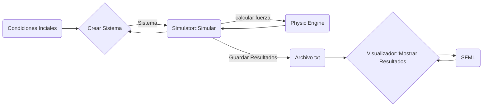

```mermaid
flowchart LR
Z(Condiciones Inciales)-->A
  A[Start] --Sistema--> B(Simulator::Simular)
  B --> A{Crear Sistema}
  B -- calcular fuerza --> D(Physic Engine)
  D --> B
  B -- Guardar Resultados --> W(Archivo txt)
  W -->F{Visualizador::Mostrar Resultados}
  F-->G(SFML)
  G-->F

```